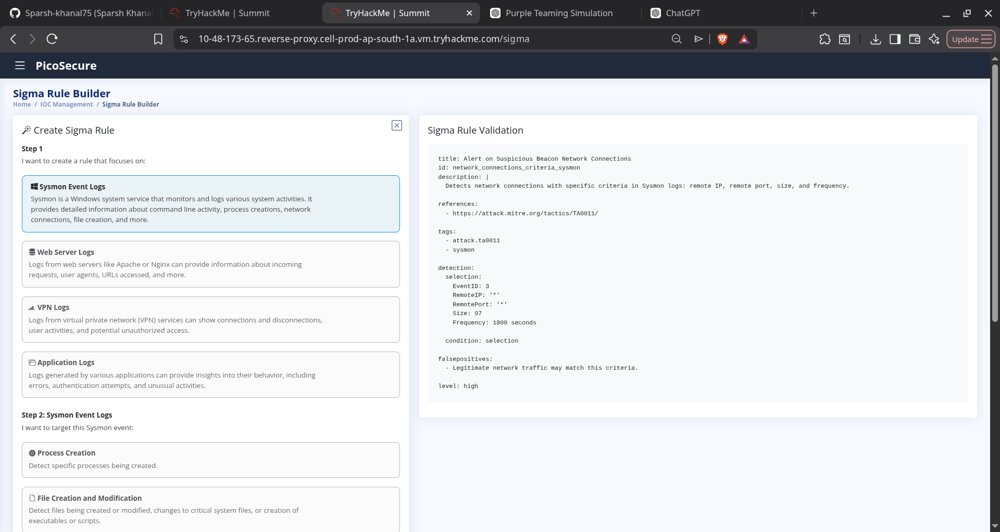
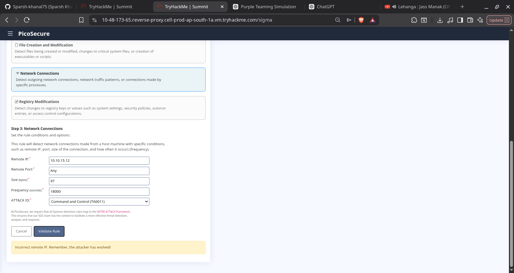
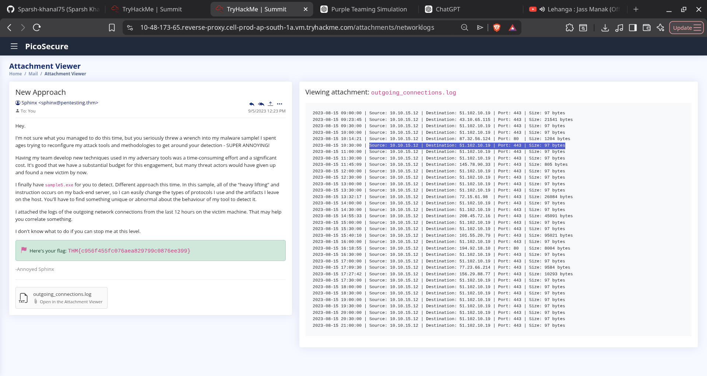

# 🛡️ Detection Engineering with the Pyramid of Pain

### *TryHackMe Purple Teaming Challenge*

<p align="center">


</p>

---

# 📖 Overview

This room simulates a **Purple Team engagement** where an attacker continuously evolves their malware to bypass security controls while the defender improves detections after every attack.

Instead of relying solely on **Indicators of Compromise (IOCs)** such as hashes or IP addresses, the objective is to gradually move toward **behavior-based detection**, forcing the attacker to redesign their malware instead of making simple changes.

---

# 🎯 Learning Objectives

* ✅ Understand the Pyramid of Pain
* ✅ Improve malware detections iteratively
* ✅ Learn Sigma detection concepts
* ✅ Understand Sysmon Event IDs
* ✅ Map detections to MITRE ATT&CK
* ✅ Detect attacker behavior instead of static IOCs

---

# 🏔️ Pyramid of Pain Progression

| Stage | Detection           | Attacker Evasion        | Better Detection     |
| :---: | ------------------- | ----------------------- | -------------------- |
|  1️⃣  | File Hash           | Recompile Malware       | IP Address           |
|  2️⃣  | IP Address          | New VPS / Cloud IP      | Domain               |
|  3️⃣  | Domain              | Register New Domain     | Host Artifacts       |
|  4️⃣  | Registry Artifact   | Change Malware Logic    | Behavioral Detection |
|  5️⃣  | C2 Infrastructure   | Infrastructure Rotation | Beaconing Detection  |
|  6️⃣  | Individual Commands | Change Tools            | TTP Detection        |

---

# 🔹 Task 1 — Hash Detection

## Detection

```
SHA256
```

### ✔ Advantages

* Very accurate
* High confidence
* Low false positives

### ❌ Weakness

Changing a single byte changes the entire hash.

### 📚 Learning

Hash detection is useful for known malware but is extremely easy for attackers to bypass.

---

# 🔹 Task 2 — IP Address Detection

Observed C2 Connection

```
154.35.10.113:4444
```

### Detection

Block outbound communication to the malicious IP.

### ❌ Weakness

Attackers can quickly migrate to another VPS or cloud provider.

### 📚 Learning

Infrastructure changes are inexpensive for attackers.

---

# 🔹 Task 3 — Domain Detection

Observed Domain

```
emudyn.bresonicz.info
```

### Detection

Block the malicious domain.

### ❌ Weakness

Attackers can register new domains.

### 📚 Learning

Domains are stronger indicators than IP addresses but still belong to attacker infrastructure.

---

# 🔹 Task 4 — Host Artifact Detection

Observed Registry Modification

```
HKEY_LOCAL_MACHINE
└── SOFTWARE
    └── Microsoft
        └── Windows Defender
            └── Real-Time Protection
                └── DisableRealtimeMonitoring = 1
```

### Detection

Detect registry modifications instead of malware hashes.

### MITRE ATT&CK

| Technique     | Description     |
| ------------- | --------------- |
| **T1562.001** | Impair Defenses |

---

# 🔹 Task 5 — Detecting C2 Beaconing

Observed Network Pattern

```
Destination:
51.102.10.19

Every:
30 Minutes

Packet Size:
97 Bytes
```

### Why It Was Suspicious

* Same destination
* Fixed interval
* Same packet size
* Continuous communication

### Detection

Instead of detecting:

```
IP Address
```

Detect

```
Repeated outbound beaconing behaviour
```

### 📚 Learning

Even if attackers change:

* IP Address
* Domain
* Protocol

They still need to communicate with their Command & Control server.

Behavior is much harder to change.

### MITRE ATT&CK

| Tactic                         |
| ------------------------------ |
| **TA0011 — Command & Control** |

---

# 🔹 Task 6 — Detecting TTPs

Observed Commands

```cmd
dir c:\ >> %temp%\exfiltr8.log
dir "c:\Documents and Settings" >> %temp%\exfiltr8.log
dir "c:\Program Files\" >> %temp%\exfiltr8.log
dir d:\ >> %temp%\exfiltr8.log
net localgroup administrator >> %temp%\exfiltr8.log
ver >> %temp%\exfiltr8.log
systeminfo >> %temp%\exfiltr8.log
ipconfig /all >> %temp%\exfiltr8.log
netstat -ano >> %temp%\exfiltr8.log
net start >> %temp%\exfiltr8.log
```

## Purpose of These Commands

| Command                        | Purpose                      |
| ------------------------------ | ---------------------------- |
| `dir`                          | File & Directory Discovery   |
| `systeminfo`                   | System Discovery             |
| `ipconfig /all`                | Network Discovery            |
| `netstat -ano`                 | Network Connection Discovery |
| `net start`                    | Service Discovery            |
| `net localgroup administrator` | Account Discovery            |
| `ver`                          | OS Discovery                 |

---

## MITRE ATT&CK Mapping

| Tactic     | Description |
| ---------- | ----------- |
| **TA0007** | Discovery   |

The attacker is gathering information before attempting privilege escalation or lateral movement.

---

# 🧠 Sigma Concepts Learned

✔ Process Creation

✔ Registry Modification

✔ Network Connections

✔ Host Artifacts

✔ Behavioral Detection

✔ MITRE ATT&CK Mapping

---

# 🛡️ Detection Evolution

```text
Hash
   │
   ▼
IP Address
   │
   ▼
Domain
   │
   ▼
Host Artifact
   │
   ▼
Behavior
   │
   ▼
TTP
```

The higher we move on the Pyramid of Pain, the more expensive it becomes for attackers to evade detection.

---

# 💡 Key Takeaways

* Hashes provide high-confidence detections but are trivial to evade.
* IP addresses and domains represent attacker infrastructure and can be rotated.
* Registry modifications and host artifacts provide stronger detections.
* C2 beaconing focuses on communication patterns instead of infrastructure.
* TTP-based detections are the most resilient because they target **how** attackers operate rather than **what** they use.

---

# 🛠️ Skills Demonstrated

* Detection Engineering
* Sigma Rule Development
* MITRE ATT&CK Mapping
* Sysmon Analysis
* Purple Teaming
* IOC Analysis
* Behavioral Detection
* Threat Hunting
* Windows Internals
* Network Traffic Analysis

---
# 📸 Snapshots

<p align="center">
  
</p>

<p align="center">
  
</p>

<p align="center">
  
</p>
<p align="center">

⭐ **The ultimate lesson from this room:**
**Don't chase malware samples—chase attacker behavior.**

</p>
